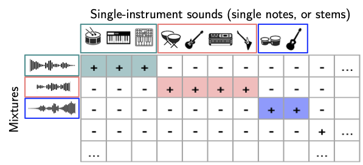

# Contrastive Instrument Retrieval

Code for the paper "Contrastive timbre representations for musical instrument and synthesizer retrieval" 
([arXiv preprint](https://arxiv.org/abs/2509.13285), accepted to ICASSP 2026). Audio examples are available on the [companion page](https://gwendal-lv.github.io/CIR/).

 

## Introduction 

This work introduces a contrastive learning framework for musical instrument retrieval, 
enabling direct querying of instrument databases using a single model for both single- and multi-instrument sounds.

 

## Usage

The best checkpoint for Percussion / Bass / Synth Lead separation can be downloaded: [ICASSP26_Triplet-full_bs48_ckpt_final.pt](https://drive.google.com/file/d/1yHpwcLul1JvpAQO7NiBhQ15L8cmxakjs/view?usp=share_link).
It has been tested for NSynth and Surge sounds from these three families only.

The model can be loaded with:
```python
from AST import ASTFineTuned
model = ASTFineTuned.from_checkpoint('./ICASSP26_Triplet-full_bs48_ckpt_final.pt')
model.test_with_dummy_audio()
```

For usage examples, see the implementation in `AST.py`.

# Training

## Data

The "small" versions of the NSynth and Surge datasets are 
[available on Google Drive](https://drive.google.com/file/d/1HDVu7MVcQm9EXGtR5cnmYeKo_0rprVcR/view?usp=share_link). 
All datasets should be extracted into `./data/`.

The full versions used to train models presented in the paper are unfortunately too big (hundreds of GBs) to be shared.
The full [NSynth dataset](https://magenta.withgoogle.com/datasets/nsynth) can be downloaded and the metadata needs to be rearranged a bit.
The full Surge dataset can be generated using [surge-python](https://github.com/surge-synthesizer/surge-python).

## W&B logging

Create the `./secrets.yaml` files with the following content for W&B logging:
```
wandb:
  api_key: 'YOUR_API_KEY'
  team: 'YOUR_TEAM_NAME'  
```

## Configure and run

Models and training parameters are defined in `configs/`. Usage:
```
python3 ASTtrainer.py config/AST-contrast-mix.yaml
```

# Citation

If you use this code, please cite the following [preprint](https://arxiv.org/abs/2509.13285) (accepted to ICASSP 2026):

```bibtex
@misc{levaillant2025contrastivetimbrerepresentations,
      title={Contrastive timbre representations for musical instrument and synthesizer retrieval}, 
      author={Gwendal Le Vaillant and Yannick Molle},
      year={2025},
      eprint={2509.13285},
      archivePrefix={arXiv},
      primaryClass={cs.SD},
      url={https://arxiv.org/abs/2509.13285}, 
}
```
