# Contrastive Instrument Retrieval (CIR)

Accompanying material for the preprint
[Contrastive Timbre Representations for Musical Instrument and Synthesizer Retrieval](https://arxiv.org/abs/2509.13285), 
accepted to IEEE ICASSP 2026.

Authors: Gwendal Le Vaillant, Yannick Molle

Code : [github.com/gwendal-lv/CIR](https://github.com/gwendal-lv/CIR)

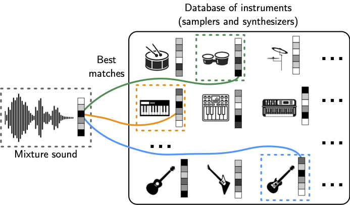

## Abstract

Efficiently retrieving specific instrument timbres from audio mixtures remains a challenge in digital music production. This paper introduces a contrastive learning framework for musical instrument retrieval, 
enabling direct querying of instrument databases using a single model for both single- and multi-instrument sounds. 
We propose techniques to generate realistic positive/negative pairs of sounds for virtual musical instruments, such as samplers and synthesizers, addressing limitations in common audio data augmentation methods. 

The first experiment focuses on instrument retrieval from a dataset of 3,884 instruments, using single-instrument audio as input. Contrastive approaches are competitive with previous works based on classification pre-training.
The second experiment considers multi-instrument retrieval with a mixture of instruments as audio input.
In this case, the proposed contrastive framework outperforms related works, achieving 84.2% top-1 and 96.4% top-5 accuracies for three-instrument mixtures.

## Table of Contents

- Audio examples
  - [Example 1](#example-1)
  - [Example 2](#example-2)
  - [Example 3](#example-3)
  - [Example 4](#example-4)
  - [Example 5](#example-5)
  - [Example 6](#example-6)
  - [Example 7](#example-7)
- [Additional results](#additional-results)
  - [Surge presets retrieval accuracy](#surge-presets-retrieval-accuracy)
  - [Nsynth instruments retrieval accuracy](#nsynth-instruments-retrieval-accuracy)

---

# Example 1

## Input mixture

<audio controls><source src="data/29/Mix.mp3" type="audio/mpeg"></audio>

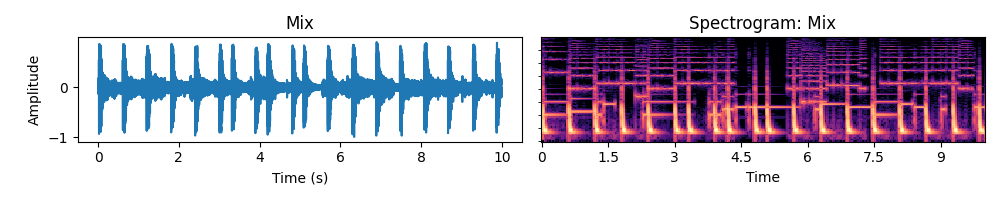

## Instruments retrieved from the input mixture

### Percussion

| Ground truth | • | 1st best match | 2nd best match | 3rd best match |
| --- | --- | --- | --- | --- |
| <audio controls style="width: 200px;"><source src="data/29/Percussion_GT.mp3" type="audio/mpeg"></audio>  | • |   <audio controls style="width: 200px;"><source src="data/29/Percussion_match_1.mp3" type="audio/mpeg"></audio> | <audio controls style="width: 200px;"><source src="data/29/Percussion_match_2.mp3" type="audio/mpeg"></audio> | <audio controls style="width: 200px;"><source src="data/29/Percussion_match_3.mp3" type="audio/mpeg"></audio> |
   | •  |  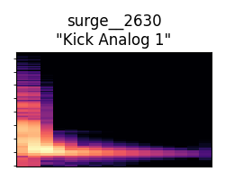 | 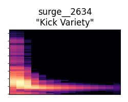 | 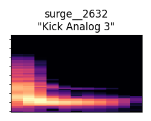 |

### Bass

| Ground truth | • | 1st best match | 2nd best match | 3rd best match |
| --- | --- | --- | --- | --- |
| <audio controls style="width: 200px;"><source src="data/29/Bass_GT.mp3" type="audio/mpeg"></audio>  | • |   <audio controls style="width: 200px;"><source src="data/29/Bass_match_1.mp3" type="audio/mpeg"></audio> | <audio controls style="width: 200px;"><source src="data/29/Bass_match_2.mp3" type="audio/mpeg"></audio> | <audio controls style="width: 200px;"><source src="data/29/Bass_match_3.mp3" type="audio/mpeg"></audio> |
 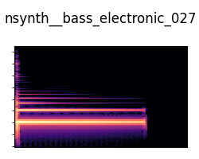  | •  |  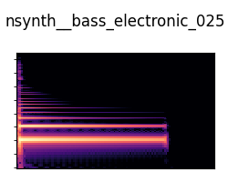 | 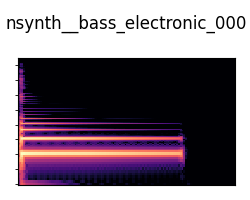 |  |

### Synth Lead

| Ground truth | • | 1st best match | 2nd best match | 3rd best match |
| --- | --- | --- | --- | --- |
| <audio controls style="width: 200px;"><source src="data/29/Synth_Lead_GT.mp3" type="audio/mpeg"></audio>  | • |   <audio controls  style="width: 200px;"><source src="data/29/Synth_Lead_match_1.mp3" type="audio/mpeg"></audio> | <audio controls style="width: 200px;"><source src="data/29/Synth_Lead_match_2.mp3" type="audio/mpeg"></audio> | <audio controls style="width: 200px;"><source src="data/29/Synth_Lead_match_3.mp3" type="audio/mpeg"></audio> |
 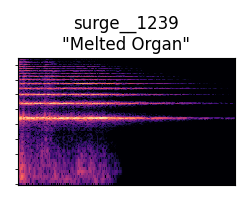  | •  |   | 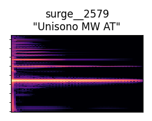 | 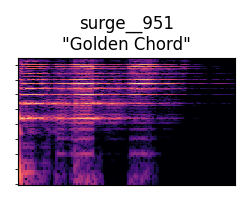 |
 

# Example 2

## Input mixture

<audio controls><source src="data/31/Mix.mp3" type="audio/mpeg"></audio>

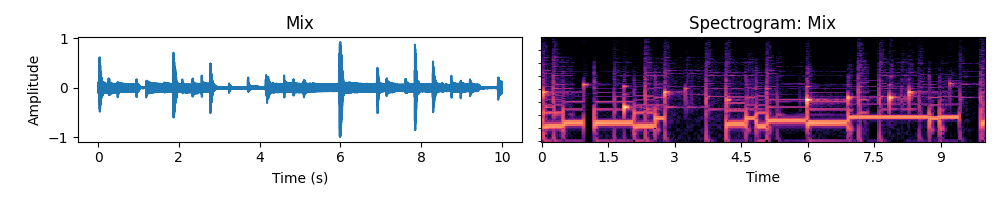

## Instruments retrieved from the input mixture

### Percussion

| Ground truth | • | 1st best match | 2nd best match | 3rd best match |
| --- | --- | --- | --- | --- |
| <audio controls style="width: 200px;"><source src="data/31/Percussion_GT.mp3" type="audio/mpeg"></audio>  | • |   <audio controls style="width: 200px;"><source src="data/31/Percussion_match_1.mp3" type="audio/mpeg"></audio> | <audio controls style="width: 200px;"><source src="data/31/Percussion_match_2.mp3" type="audio/mpeg"></audio> | <audio controls style="width: 200px;"><source src="data/31/Percussion_match_3.mp3" type="audio/mpeg"></audio> |
 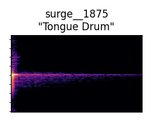  | •  |   | 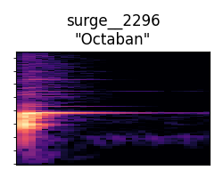 | 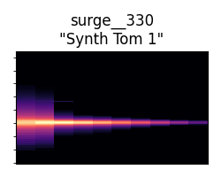 |

### Bass

| Ground truth | • | 1st best match | 2nd best match | 3rd best match |
| --- | --- | --- | --- | --- |
| <audio controls style="width: 200px;"><source src="data/31/Bass_GT.mp3" type="audio/mpeg"></audio>  | • |   <audio controls style="width: 200px;"><source src="data/31/Bass_match_1.mp3" type="audio/mpeg"></audio> | <audio controls style="width: 200px;"><source src="data/31/Bass_match_2.mp3" type="audio/mpeg"></audio> | <audio controls style="width: 200px;"><source src="data/31/Bass_match_3.mp3" type="audio/mpeg"></audio> |
 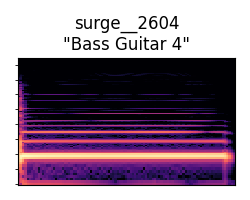  | •  |   | 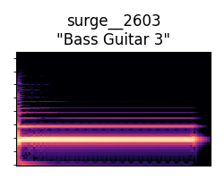 | 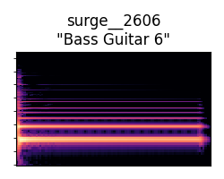 |

### Synth Lead

| Ground truth | • | 1st best match | 2nd best match | 3rd best match |
| --- | --- | --- | --- | --- |
| <audio controls style="width: 200px;"><source src="data/31/Synth_Lead_GT.mp3" type="audio/mpeg"></audio>  | • |   <audio controls  style="width: 200px;"><source src="data/31/Synth_Lead_match_1.mp3" type="audio/mpeg"></audio> | <audio controls style="width: 200px;"><source src="data/31/Synth_Lead_match_2.mp3" type="audio/mpeg"></audio> | <audio controls style="width: 200px;"><source src="data/31/Synth_Lead_match_3.mp3" type="audio/mpeg"></audio> |
 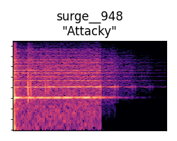  | •  |   | 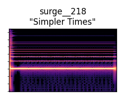 | 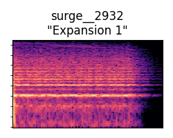 |
 

# Example 3

## Input mixture

<audio controls><source src="data/11/Mix.mp3" type="audio/mpeg"></audio>

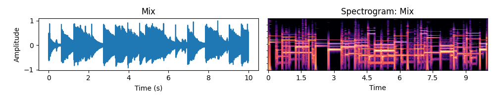

## Instruments retrieved from the input mixture

### Percussion

| Ground truth | • | 1st best match | 2nd best match | 3rd best match |
| --- | --- | --- | --- | --- |
| <audio controls style="width: 200px;"><source src="data/11/Percussion_GT.mp3" type="audio/mpeg"></audio>  | • |   <audio controls style="width: 200px;"><source src="data/11/Percussion_match_1.mp3" type="audio/mpeg"></audio> | <audio controls style="width: 200px;"><source src="data/11/Percussion_match_2.mp3" type="audio/mpeg"></audio> | <audio controls style="width: 200px;"><source src="data/11/Percussion_match_3.mp3" type="audio/mpeg"></audio> |
 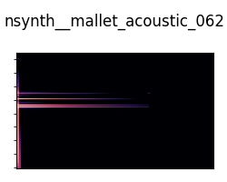  | •  |   | 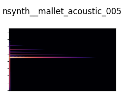 | 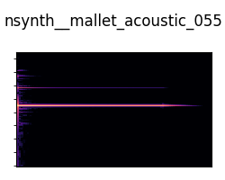 |

### Bass

| Ground truth | • | 1st best match | 2nd best match | 3rd best match |
| --- | --- | --- | --- | --- |
| <audio controls style="width: 200px;"><source src="data/11/Bass_GT.mp3" type="audio/mpeg"></audio>  | • |   <audio controls style="width: 200px;"><source src="data/11/Bass_match_1.mp3" type="audio/mpeg"></audio> | <audio controls style="width: 200px;"><source src="data/11/Bass_match_2.mp3" type="audio/mpeg"></audio> | <audio controls style="width: 200px;"><source src="data/11/Bass_match_3.mp3" type="audio/mpeg"></audio> |
 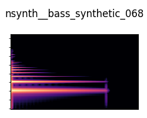  | •  |  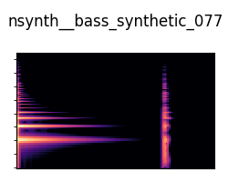 |  | 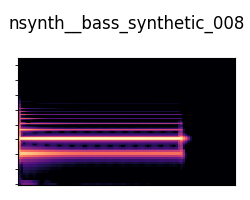 |

 
### Synth Lead

| Ground truth | • | 1st best match | 2nd best match | 3rd best match |
| --- | --- | --- | --- | --- |
| <audio controls style="width: 200px;"><source src="data/11/Synth_Lead_GT.mp3" type="audio/mpeg"></audio>  | • |   <audio controls  style="width: 200px;"><source src="data/11/Synth_Lead_match_1.mp3" type="audio/mpeg"></audio> | <audio controls style="width: 200px;"><source src="data/11/Synth_Lead_match_2.mp3" type="audio/mpeg"></audio> | <audio controls style="width: 200px;"><source src="data/11/Synth_Lead_match_3.mp3" type="audio/mpeg"></audio> |
 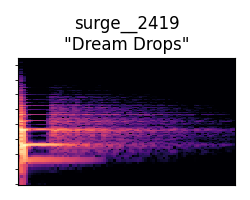  | •  |   | 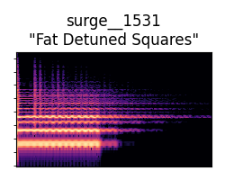 | 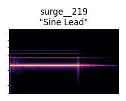 |
 
 

# Example 4

## Input mixture

<audio controls><source src="data/0/Mix.mp3" type="audio/mpeg"></audio>

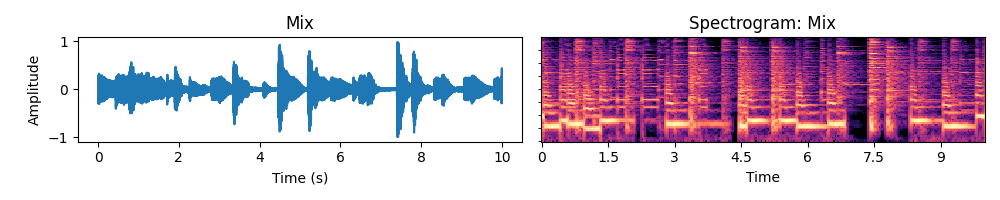

## Instruments retrieved from the input mixture

### Percussion

| Ground truth | • | 1st best match | 2nd best match | 3rd best match |
| --- | --- | --- | --- | --- |
| <audio controls style="width: 200px;"><source src="data/0/Percussion_GT.mp3" type="audio/mpeg"></audio>  | • |   <audio controls style="width: 200px;"><source src="data/0/Percussion_match_1.mp3" type="audio/mpeg"></audio> | <audio controls style="width: 200px;"><source src="data/0/Percussion_match_2.mp3" type="audio/mpeg"></audio> | <audio controls style="width: 200px;"><source src="data/0/Percussion_match_3.mp3" type="audio/mpeg"></audio> |
 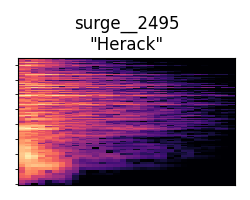  | •  |   | 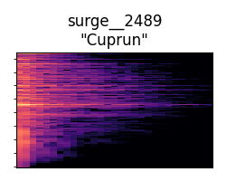 | 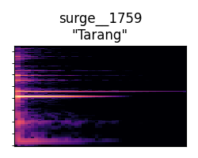 |

### Bass

| Ground truth | • | 1st best match | 2nd best match | 3rd best match |
| --- | --- | --- | --- | --- |
| <audio controls style="width: 200px;"><source src="data/0/Bass_GT.mp3" type="audio/mpeg"></audio>  | • |   <audio controls style="width: 200px;"><source src="data/0/Bass_match_1.mp3" type="audio/mpeg"></audio> | <audio controls style="width: 200px;"><source src="data/0/Bass_match_2.mp3" type="audio/mpeg"></audio> | <audio controls style="width: 200px;"><source src="data/0/Bass_match_3.mp3" type="audio/mpeg"></audio> |
 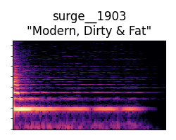  | •  |   | 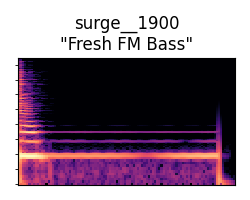 | 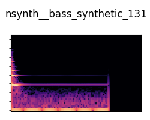 |

### Synth Lead

| Ground truth | • | 1st best match | 2nd best match | 3rd best match |
| --- | --- | --- | --- | --- |
| <audio controls style="width: 200px;"><source src="data/0/Synth_Lead_GT.mp3" type="audio/mpeg"></audio>  | • |   <audio controls  style="width: 200px;"><source src="data/0/Synth_Lead_match_1.mp3" type="audio/mpeg"></audio> | <audio controls style="width: 200px;"><source src="data/0/Synth_Lead_match_2.mp3" type="audio/mpeg"></audio> | <audio controls style="width: 200px;"><source src="data/0/Synth_Lead_match_3.mp3" type="audio/mpeg"></audio> |
 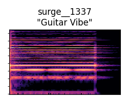  | •  |   |  | 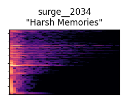 |
 

# Example 5

## Input mixture

<audio controls><source src="data/37/Mix.mp3" type="audio/mpeg"></audio>

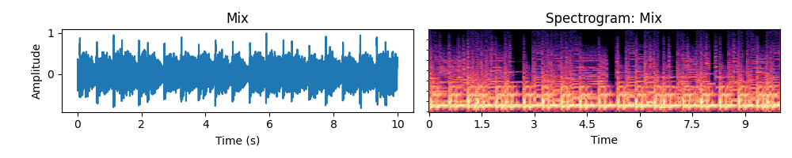

## Instruments retrieved from the input mixture

### Percussion

| Ground truth | • | 1st best match | 2nd best match | 3rd best match |
| --- | --- | --- | --- | --- |
| <audio controls style="width: 200px;"><source src="data/37/Percussion_GT.mp3" type="audio/mpeg"></audio>  | • |   <audio controls style="width: 200px;"><source src="data/37/Percussion_match_1.mp3" type="audio/mpeg"></audio> | <audio controls style="width: 200px;"><source src="data/37/Percussion_match_2.mp3" type="audio/mpeg"></audio> | <audio controls style="width: 200px;"><source src="data/37/Percussion_match_3.mp3" type="audio/mpeg"></audio> |
 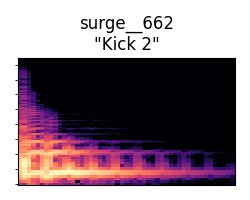  | •  |   | 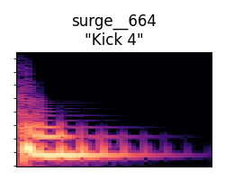 | 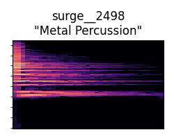 |

### Bass

| Ground truth | • | 1st best match | 2nd best match | 3rd best match |
| --- | --- | --- | --- | --- |
| <audio controls style="width: 200px;"><source src="data/37/Bass_GT.mp3" type="audio/mpeg"></audio>  | • |   <audio controls style="width: 200px;"><source src="data/37/Bass_match_1.mp3" type="audio/mpeg"></audio> | <audio controls style="width: 200px;"><source src="data/37/Bass_match_2.mp3" type="audio/mpeg"></audio> | <audio controls style="width: 200px;"><source src="data/37/Bass_match_3.mp3" type="audio/mpeg"></audio> |
 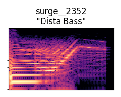  | •  |  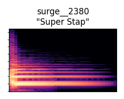 | 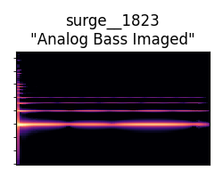 |  |

### Synth Lead

| Ground truth | • | 1st best match | 2nd best match | 3rd best match |
| --- | --- | --- | --- | --- |
| <audio controls style="width: 200px;"><source src="data/37/Synth_Lead_GT.mp3" type="audio/mpeg"></audio>  | • |   <audio controls  style="width: 200px;"><source src="data/37/Synth_Lead_match_1.mp3" type="audio/mpeg"></audio> | <audio controls style="width: 200px;"><source src="data/37/Synth_Lead_match_2.mp3" type="audio/mpeg"></audio> | <audio controls style="width: 200px;"><source src="data/37/Synth_Lead_match_3.mp3" type="audio/mpeg"></audio> |
 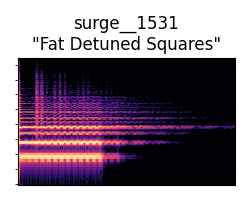  | •  |   | 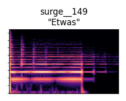 |  |
 

# Example 6

## Input mixture

<audio controls><source src="data/49/Mix.mp3" type="audio/mpeg"></audio>

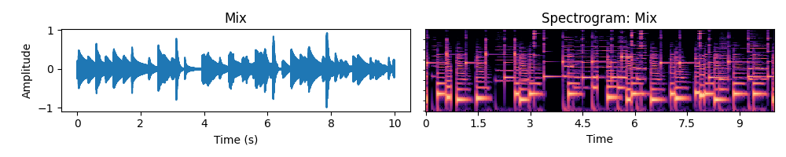

## Instruments retrieved from the input mixture

### Percussion

| Ground truth | • | 1st best match | 2nd best match | 3rd best match |
| --- | --- | --- | --- | --- |
| <audio controls style="width: 200px;"><source src="data/49/Percussion_GT.mp3" type="audio/mpeg"></audio>  | • |   <audio controls style="width: 200px;"><source src="data/49/Percussion_match_1.mp3" type="audio/mpeg"></audio> | <audio controls style="width: 200px;"><source src="data/49/Percussion_match_2.mp3" type="audio/mpeg"></audio> | <audio controls style="width: 200px;"><source src="data/49/Percussion_match_3.mp3" type="audio/mpeg"></audio> |
   | •  |   |  |  |

### Bass

| Ground truth | • | 1st best match | 2nd best match | 3rd best match |
| --- | --- | --- | --- | --- |
| <audio controls style="width: 200px;"><source src="data/49/Bass_GT.mp3" type="audio/mpeg"></audio>  | • |   <audio controls style="width: 200px;"><source src="data/49/Bass_match_1.mp3" type="audio/mpeg"></audio> | <audio controls style="width: 200px;"><source src="data/49/Bass_match_2.mp3" type="audio/mpeg"></audio> | <audio controls style="width: 200px;"><source src="data/49/Bass_match_3.mp3" type="audio/mpeg"></audio> |
   | •  |   |  |  |

### Synth Lead

| Ground truth | • | 1st best match | 2nd best match | 3rd best match |
| --- | --- | --- | --- | --- |
| <audio controls style="width: 200px;"><source src="data/49/Synth_Lead_GT.mp3" type="audio/mpeg"></audio>  | • |   <audio controls  style="width: 200px;"><source src="data/49/Synth_Lead_match_1.mp3" type="audio/mpeg"></audio> | <audio controls style="width: 200px;"><source src="data/49/Synth_Lead_match_2.mp3" type="audio/mpeg"></audio> | <audio controls style="width: 200px;"><source src="data/49/Synth_Lead_match_3.mp3" type="audio/mpeg"></audio> |
   | •  |   |  |  |
 

# Example 7

## Input mixture

<audio controls><source src="data/13/Mix.mp3" type="audio/mpeg"></audio>

## Instruments retrieved from the input mixture

### Percussion

| Ground truth | • | 1st best match | 2nd best match | 3rd best match |
| --- | --- | --- | --- | --- |
| <audio controls style="width: 200px;"><source src="data/13/Percussion_GT.mp3" type="audio/mpeg"></audio>  | • |   <audio controls style="width: 200px;"><source src="data/13/Percussion_match_1.mp3" type="audio/mpeg"></audio> | <audio controls style="width: 200px;"><source src="data/13/Percussion_match_2.mp3" type="audio/mpeg"></audio> | <audio controls style="width: 200px;"><source src="data/13/Percussion_match_3.mp3" type="audio/mpeg"></audio> |
   | •  |   |  |  |

### Bass

| Ground truth | • | 1st best match | 2nd best match | 3rd best match |
| --- | --- | --- | --- | --- |
| <audio controls style="width: 200px;"><source src="data/13/Bass_GT.mp3" type="audio/mpeg"></audio>  | • |   <audio controls style="width: 200px;"><source src="data/13/Bass_match_1.mp3" type="audio/mpeg"></audio> | <audio controls style="width: 200px;"><source src="data/13/Bass_match_2.mp3" type="audio/mpeg"></audio> | <audio controls style="width: 200px;"><source src="data/13/Bass_match_3.mp3" type="audio/mpeg"></audio> |
   | •  |   |  |  |

### Synth Lead

| Ground truth | • | 1st best match | 2nd best match | 3rd best match |
| --- | --- | --- | --- | --- |
| <audio controls style="width: 200px;"><source src="data/13/Synth_Lead_GT.mp3" type="audio/mpeg"></audio>  | • |   <audio controls  style="width: 200px;"><source src="data/13/Synth_Lead_match_1.mp3" type="audio/mpeg"></audio> | <audio controls style="width: 200px;"><source src="data/13/Synth_Lead_match_2.mp3" type="audio/mpeg"></audio> | <audio controls style="width: 200px;"><source src="data/13/Synth_Lead_match_3.mp3" type="audio/mpeg"></audio> |
   | •  |   |  |  |
 

---

# Additional results

The following tables are extensions of the results presented in Table 2 the paper.
The dataset for 3-component mixtures is reduced to 1463 instruments:
615 *basses*, 480 *synth leads* and 368 *percussions*.

## Surge presets retrieval accuracy

|                                   | Percussion - Top-1 | Percussion - Top-5 | Bass - Top-1 | Bass - Top-5 | Synth lead - Top 1 | Synth lead - Top 5 |
|-----------------------------------|--------------------|--------------------|--------------|--------------|--------------------|--------------------|
| Full triplet loss - batch size 24 | 91.7 %             | 99.5 %             | 79.3 %       | 93.1 %       | 82.5 %             | 94.2 %             |
| Full triplet loss - batch size 48 | **92.1 %**         | **99.8 %**         | **83.3 %**   | **94.6 %**   | **85.8 %**         | **94.7 %**         |
| InfoNCE loss - batch size 24      | 74.4 %             | 98.4 %             | 67.9 %       | 89.7 %       | 63.4 %             | 88.9 %             |
| InfoNCE loss - batch size 48      | 78.4 %             | 98.7 %             | 82.1 %       | 94.4 %       | 69.1 %             | 91.6 %             |

## Nsynth instruments retrieval accuracy

|                                   | Percussion - Top-1 | Percussion - Top-5 | Bass - Top-1 | Bass - Top-5 |
|-----------------------------------|--------------------|--------------------|--------------|--------------|
| Full triplet loss - batch size 24 | **80.2 %**         | **100.0 %**        | 57.6 %       | **94.8 %**   |
| Full triplet loss - batch size 48 | 47.4 %             | 99.7 %             | **71.8 %**   | 94.7 %       |
| InfoNCE loss - batch size 24      | 44.3 %             | 95.4 %             | 42.1 %       | 87.2 %       |
| InfoNCE loss - batch size 48      | 33.3 %             | 78.4 %             | **71.8 %**   | 93.5 %       |

