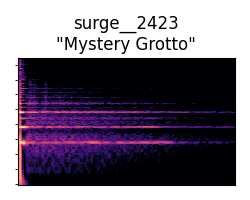

**Contrastive Instrument Retrieval (CIR)**

Accompanying material for the preprint: "Contrastive timbre representations for music instrument and synthesizer retrieval"

Authors: Gwendal Le Vaillant, Yannick Molle

2025

# Example 1

## Input mixture

<audio controls><source src="data/29/Mix.mp3" type="audio/mpeg"></audio>

## Instruments retrieved from the input mixture

### Percussion

| Ground truth | • | 1st best match | 2nd best match | 3rd best match |
| --- | --- | --- | --- | --- |
| <audio controls style="width: 200px;"><source src="data/29/Percussion_GT.mp3" type="audio/mpeg"></audio>  | • |   <audio controls style="width: 200px;"><source src="data/29/Percussion_match_1.mp3" type="audio/mpeg"></audio> | <audio controls style="width: 200px;"><source src="data/29/Percussion_match_2.mp3" type="audio/mpeg"></audio> | <audio controls style="width: 200px;"><source src="data/29/Percussion_match_3.mp3" type="audio/mpeg"></audio> |
   | •  |   |  |  |

### Bass

| Ground truth | • | 1st best match | 2nd best match | 3rd best match |
| --- | --- | --- | --- | --- |
| <audio controls style="width: 200px;"><source src="data/29/Bass_GT.mp3" type="audio/mpeg"></audio>  | • |   <audio controls style="width: 200px;"><source src="data/29/Bass_match_1.mp3" type="audio/mpeg"></audio> | <audio controls style="width: 200px;"><source src="data/29/Bass_match_2.mp3" type="audio/mpeg"></audio> | <audio controls style="width: 200px;"><source src="data/29/Bass_match_3.mp3" type="audio/mpeg"></audio> |
   | •  |   |  |  |

### Synth Lead

| Ground truth | • | 1st best match | 2nd best match | 3rd best match |
| --- | --- | --- | --- | --- |
| <audio controls style="width: 200px;"><source src="data/29/Synth_Lead_GT.mp3" type="audio/mpeg"></audio>  | • |   <audio controls  style="width: 200px;"><source src="data/29/Synth_Lead_match_1.mp3" type="audio/mpeg"></audio> | <audio controls style="width: 200px;"><source src="data/29/Synth_Lead_match_2.mp3" type="audio/mpeg"></audio> | <audio controls style="width: 200px;"><source src="data/29/Synth_Lead_match_3.mp3" type="audio/mpeg"></audio> |
   | •  |   |  |  |
 

# Example 2

## Input mixture

<audio controls><source src="data/31/Mix.mp3" type="audio/mpeg"></audio>

## Instruments retrieved from the input mixture

### Percussion

| Ground truth | • | 1st best match | 2nd best match | 3rd best match |
| --- | --- | --- | --- | --- |
| <audio controls style="width: 200px;"><source src="data/31/Percussion_GT.mp3" type="audio/mpeg"></audio>  | • |   <audio controls style="width: 200px;"><source src="data/31/Percussion_match_1.mp3" type="audio/mpeg"></audio> | <audio controls style="width: 200px;"><source src="data/31/Percussion_match_2.mp3" type="audio/mpeg"></audio> | <audio controls style="width: 200px;"><source src="data/31/Percussion_match_3.mp3" type="audio/mpeg"></audio> |
   | •  |   |  |  |

### Bass

| Ground truth | • | 1st best match | 2nd best match | 3rd best match |
| --- | --- | --- | --- | --- |
| <audio controls style="width: 200px;"><source src="data/31/Bass_GT.mp3" type="audio/mpeg"></audio>  | • |   <audio controls style="width: 200px;"><source src="data/31/Bass_match_1.mp3" type="audio/mpeg"></audio> | <audio controls style="width: 200px;"><source src="data/31/Bass_match_2.mp3" type="audio/mpeg"></audio> | <audio controls style="width: 200px;"><source src="data/31/Bass_match_3.mp3" type="audio/mpeg"></audio> |
   | •  |   |  |  |

### Synth Lead

| Ground truth | • | 1st best match | 2nd best match | 3rd best match |
| --- | --- | --- | --- | --- |
| <audio controls style="width: 200px;"><source src="data/31/Synth_Lead_GT.mp3" type="audio/mpeg"></audio>  | • |   <audio controls  style="width: 200px;"><source src="data/31/Synth_Lead_match_1.mp3" type="audio/mpeg"></audio> | <audio controls style="width: 200px;"><source src="data/31/Synth_Lead_match_2.mp3" type="audio/mpeg"></audio> | <audio controls style="width: 200px;"><source src="data/31/Synth_Lead_match_3.mp3" type="audio/mpeg"></audio> |
   | •  |   |  |  |
 

# Example 3

## Input mixture

<audio controls><source src="data/11/Mix.mp3" type="audio/mpeg"></audio>

## Instruments retrieved from the input mixture

### Percussion

| Ground truth | • | 1st best match | 2nd best match | 3rd best match |
| --- | --- | --- | --- | --- |
| <audio controls style="width: 200px;"><source src="data/11/Percussion_GT.mp3" type="audio/mpeg"></audio>  | • |   <audio controls style="width: 200px;"><source src="data/11/Percussion_match_1.mp3" type="audio/mpeg"></audio> | <audio controls style="width: 200px;"><source src="data/11/Percussion_match_2.mp3" type="audio/mpeg"></audio> | <audio controls style="width: 200px;"><source src="data/11/Percussion_match_3.mp3" type="audio/mpeg"></audio> |
   | •  |   |  |  |

### Bass

| Ground truth | • | 1st best match | 2nd best match | 3rd best match |
| --- | --- | --- | --- | --- |
| <audio controls style="width: 200px;"><source src="data/11/Bass_GT.mp3" type="audio/mpeg"></audio>  | • |   <audio controls style="width: 200px;"><source src="data/11/Bass_match_1.mp3" type="audio/mpeg"></audio> | <audio controls style="width: 200px;"><source src="data/11/Bass_match_2.mp3" type="audio/mpeg"></audio> | <audio controls style="width: 200px;"><source src="data/11/Bass_match_3.mp3" type="audio/mpeg"></audio> |
   | •  |   |  |  |

 
### Synth Lead

| Ground truth | • | 1st best match | 2nd best match | 3rd best match |
| --- | --- | --- | --- | --- |
| <audio controls style="width: 200px;"><source src="data/11/Synth_Lead_GT.mp3" type="audio/mpeg"></audio>  | • |   <audio controls  style="width: 200px;"><source src="data/11/Synth_Lead_match_1.mp3" type="audio/mpeg"></audio> | <audio controls style="width: 200px;"><source src="data/11/Synth_Lead_match_2.mp3" type="audio/mpeg"></audio> | <audio controls style="width: 200px;"><source src="data/11/Synth_Lead_match_3.mp3" type="audio/mpeg"></audio> |
   | •  |   |  |  |
 
 

# Example 4

## Input mixture

<audio controls><source src="data/0/Mix.mp3" type="audio/mpeg"></audio>

## Instruments retrieved from the input mixture

### Percussion

| Ground truth | • | 1st best match | 2nd best match | 3rd best match |
| --- | --- | --- | --- | --- |
| <audio controls style="width: 200px;"><source src="data/0/Percussion_GT.mp3" type="audio/mpeg"></audio>  | • |   <audio controls style="width: 200px;"><source src="data/0/Percussion_match_1.mp3" type="audio/mpeg"></audio> | <audio controls style="width: 200px;"><source src="data/0/Percussion_match_2.mp3" type="audio/mpeg"></audio> | <audio controls style="width: 200px;"><source src="data/0/Percussion_match_3.mp3" type="audio/mpeg"></audio> |
   | •  |   |  |  |

### Bass

| Ground truth | • | 1st best match | 2nd best match | 3rd best match |
| --- | --- | --- | --- | --- |
| <audio controls style="width: 200px;"><source src="data/0/Bass_GT.mp3" type="audio/mpeg"></audio>  | • |   <audio controls style="width: 200px;"><source src="data/0/Bass_match_1.mp3" type="audio/mpeg"></audio> | <audio controls style="width: 200px;"><source src="data/0/Bass_match_2.mp3" type="audio/mpeg"></audio> | <audio controls style="width: 200px;"><source src="data/0/Bass_match_3.mp3" type="audio/mpeg"></audio> |
   | •  |   |  |  |

### Synth Lead

| Ground truth | • | 1st best match | 2nd best match | 3rd best match |
| --- | --- | --- | --- | --- |
| <audio controls style="width: 200px;"><source src="data/0/Synth_Lead_GT.mp3" type="audio/mpeg"></audio>  | • |   <audio controls  style="width: 200px;"><source src="data/0/Synth_Lead_match_1.mp3" type="audio/mpeg"></audio> | <audio controls style="width: 200px;"><source src="data/0/Synth_Lead_match_2.mp3" type="audio/mpeg"></audio> | <audio controls style="width: 200px;"><source src="data/0/Synth_Lead_match_3.mp3" type="audio/mpeg"></audio> |
   | •  |   |  |  |
 

# Example 5

## Input mixture

<audio controls><source src="data/37/Mix.mp3" type="audio/mpeg"></audio>

## Instruments retrieved from the input mixture

### Percussion

| Ground truth | • | 1st best match | 2nd best match | 3rd best match |
| --- | --- | --- | --- | --- |
| <audio controls style="width: 200px;"><source src="data/37/Percussion_GT.mp3" type="audio/mpeg"></audio>  | • |   <audio controls style="width: 200px;"><source src="data/37/Percussion_match_1.mp3" type="audio/mpeg"></audio> | <audio controls style="width: 200px;"><source src="data/37/Percussion_match_2.mp3" type="audio/mpeg"></audio> | <audio controls style="width: 200px;"><source src="data/37/Percussion_match_3.mp3" type="audio/mpeg"></audio> |
   | •  |   |  |  |

### Bass

| Ground truth | • | 1st best match | 2nd best match | 3rd best match |
| --- | --- | --- | --- | --- |
| <audio controls style="width: 200px;"><source src="data/37/Bass_GT.mp3" type="audio/mpeg"></audio>  | • |   <audio controls style="width: 200px;"><source src="data/37/Bass_match_1.mp3" type="audio/mpeg"></audio> | <audio controls style="width: 200px;"><source src="data/37/Bass_match_2.mp3" type="audio/mpeg"></audio> | <audio controls style="width: 200px;"><source src="data/37/Bass_match_3.mp3" type="audio/mpeg"></audio> |
   | •  |   |  |  |

### Synth Lead

| Ground truth | • | 1st best match | 2nd best match | 3rd best match |
| --- | --- | --- | --- | --- |
| <audio controls style="width: 200px;"><source src="data/37/Synth_Lead_GT.mp3" type="audio/mpeg"></audio>  | • |   <audio controls  style="width: 200px;"><source src="data/37/Synth_Lead_match_1.mp3" type="audio/mpeg"></audio> | <audio controls style="width: 200px;"><source src="data/37/Synth_Lead_match_2.mp3" type="audio/mpeg"></audio> | <audio controls style="width: 200px;"><source src="data/37/Synth_Lead_match_3.mp3" type="audio/mpeg"></audio> |
   | •  |   |  |  |
 

# Example 6

## Input mixture

<audio controls><source src="data/49/Mix.mp3" type="audio/mpeg"></audio>

## Instruments retrieved from the input mixture

### Percussion

| Ground truth | • | 1st best match | 2nd best match | 3rd best match |
| --- | --- | --- | --- | --- |
| <audio controls style="width: 200px;"><source src="data/49/Percussion_GT.mp3" type="audio/mpeg"></audio>  | • |   <audio controls style="width: 200px;"><source src="data/49/Percussion_match_1.mp3" type="audio/mpeg"></audio> | <audio controls style="width: 200px;"><source src="data/49/Percussion_match_2.mp3" type="audio/mpeg"></audio> | <audio controls style="width: 200px;"><source src="data/49/Percussion_match_3.mp3" type="audio/mpeg"></audio> |
   | •  |   |  |  |

### Bass

| Ground truth | • | 1st best match | 2nd best match | 3rd best match |
| --- | --- | --- | --- | --- |
| <audio controls style="width: 200px;"><source src="data/49/Bass_GT.mp3" type="audio/mpeg"></audio>  | • |   <audio controls style="width: 200px;"><source src="data/49/Bass_match_1.mp3" type="audio/mpeg"></audio> | <audio controls style="width: 200px;"><source src="data/49/Bass_match_2.mp3" type="audio/mpeg"></audio> | <audio controls style="width: 200px;"><source src="data/49/Bass_match_3.mp3" type="audio/mpeg"></audio> |
   | •  |   |  |  |

### Synth Lead

| Ground truth | • | 1st best match | 2nd best match | 3rd best match |
| --- | --- | --- | --- | --- |
| <audio controls style="width: 200px;"><source src="data/49/Synth_Lead_GT.mp3" type="audio/mpeg"></audio>  | • |   <audio controls  style="width: 200px;"><source src="data/49/Synth_Lead_match_1.mp3" type="audio/mpeg"></audio> | <audio controls style="width: 200px;"><source src="data/49/Synth_Lead_match_2.mp3" type="audio/mpeg"></audio> | <audio controls style="width: 200px;"><source src="data/49/Synth_Lead_match_3.mp3" type="audio/mpeg"></audio> |
   | •  |   |  |  |
 

# Example 7

## Input mixture

<audio controls><source src="data/13/Mix.mp3" type="audio/mpeg"></audio>

## Instruments retrieved from the input mixture

### Percussion

| Ground truth | • | 1st best match | 2nd best match | 3rd best match |
| --- | --- | --- | --- | --- |
| <audio controls style="width: 200px;"><source src="data/13/Percussion_GT.mp3" type="audio/mpeg"></audio>  | • |   <audio controls style="width: 200px;"><source src="data/13/Percussion_match_1.mp3" type="audio/mpeg"></audio> | <audio controls style="width: 200px;"><source src="data/13/Percussion_match_2.mp3" type="audio/mpeg"></audio> | <audio controls style="width: 200px;"><source src="data/13/Percussion_match_3.mp3" type="audio/mpeg"></audio> |
   | •  |   |  |  |

### Bass

| Ground truth | • | 1st best match | 2nd best match | 3rd best match |
| --- | --- | --- | --- | --- |
| <audio controls style="width: 200px;"><source src="data/13/Bass_GT.mp3" type="audio/mpeg"></audio>  | • |   <audio controls style="width: 200px;"><source src="data/13/Bass_match_1.mp3" type="audio/mpeg"></audio> | <audio controls style="width: 200px;"><source src="data/13/Bass_match_2.mp3" type="audio/mpeg"></audio> | <audio controls style="width: 200px;"><source src="data/13/Bass_match_3.mp3" type="audio/mpeg"></audio> |
   | •  |   |  |  |

### Synth Lead

| Ground truth | • | 1st best match | 2nd best match | 3rd best match |
| --- | --- | --- | --- | --- |
| <audio controls style="width: 200px;"><source src="data/13/Synth_Lead_GT.mp3" type="audio/mpeg"></audio>  | • |   <audio controls  style="width: 200px;"><source src="data/13/Synth_Lead_match_1.mp3" type="audio/mpeg"></audio> | <audio controls style="width: 200px;"><source src="data/13/Synth_Lead_match_2.mp3" type="audio/mpeg"></audio> | <audio controls style="width: 200px;"><source src="data/13/Synth_Lead_match_3.mp3" type="audio/mpeg"></audio> |
   | •  |   |  |  |
 

